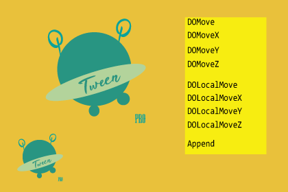
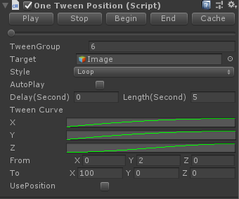
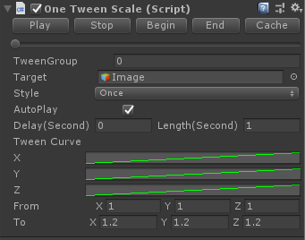
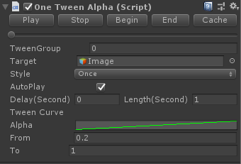
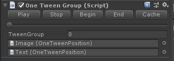

# OneTweenPro: OneTween pro version

OneTweenPro not only includes all the functions of OneTween, but also all the functions of DOTween. At present, it can basically meet all the functions of Tween on the market, which will be listed in detail below.


[OneTweenPro]( https://assetstore.unity.com/packages/slug/180185
)  is a more convenient and efficient Tween animation plugin under Unity without GC. Not only what you see is what you get, it also includes the functions of the mainstream Tween on the market.



## Features

OneTweenPro Not only includes OneTween's what you see is what you get and other functions, but also has the following unique features: 

- Support DOMove、DOMoveX、DOMoveY、DOMoveZ、DOLocalMove、DOLocalMoveX、DOLocalMoveY、DOLocalMoveZ.
- Support DOMove to pass in multiple target points, set the callback for the end of a single move and the callback for the end of the overall move.
- Support DOAlpha.
- Support DORotation、DORotationX、DORotationY、DORotationZ、DOLocalRotation、DOLocalRotationX、DOLocalRotationY、DOLocalRotationZ。
- Support DOLocalScale、DOLocalScaleX、DOLocalScaleY、DOLocalScaleZ。
- 0GC in runtime.
- Include all source code and sample scene.

## Use

1. If you need to use the related what you see is what you get function of OneTween, you need to hang the script under a Transform.

2. If you need to use DO-related functions such as DOMove, the transform component has been extended and can be used directly.

Let's demonstrate how to use it through a few simple examples.

### DOMove

If you just want to set to move to a certain point, call DOMove or DOLocalMove directly under Transform.

```c#
transform.DOLocalMove(new Vector3(2000, 2000, 2000), 1, () =>
{
    Debug.Log("DOLocalMove Complete.");
}
```

```c#
transform.DOMove(new Vector3(4000, 4000, 4000), 1, () =>
{
    Debug.Log("DOMove Complete.");
}
```

The first parameter is the coordinates of the target point.

The second parameter is the required time (unit: seconds).

The third parameter is the callback after the move.

Of course, if you just want to set a single XYZ coordinate, there is also a corresponding function.

```c#
transform.DOLocalMoveX(1000, 1, () =>
{
     Debug.Log("DOLocalMoveX Complete.");
}
                       
transform.DOLocalMoveY(1000, 1, () =>
{
     Debug.Log("DOLocalMoveY Complete.");
}
                                              
transform.DOLocalMoveZ(1000, 1, () =>
{
     Debug.Log("DOLocalMoveZ Complete.");
}
                       
                       
transform.DOMoveX(1000, 1, () =>
{
     Debug.Log("DOMoveX Complete.");
}
                       
transform.DOMoveY(1000, 1, () =>
{
     Debug.Log("DOMoveY Complete.");
}
                                              
transform.DOLocalMoveZ(1000, 1, () =>
{
     Debug.Log("DOLocalMoveZ Complete.");
}
```

Of course, you can also pass in multiple target points.

```c#
    void TestDOMoveTargets()
    {
        transform.DOMove(new List<Vector3>()
        {
            new Vector3(0, 0, 0),
            new Vector3(10, 10, 10),
            new Vector3(20, 20, 20),
            new Vector3(30, 30, 30),
        },
        10f,
        () =>
        {
            Debug.Log("One target finish.");
            Debug.Log(transform.position);
        },
        () =>
        {
            Debug.Log("All targets finish.");
            Debug.Log(transform.position);
        });
    }
```
### Append

If you want to play several different Tween animations in sequence, use Sequence.

```c#
        void TestAppend()
        {
            var sequence = new OneTweenSequence();

            sequence.Append(
                transform.DOLocalMoveX(1000, 1, () =>
                {
                    Debug.Log("DOLocalMoveX Complete.");
                })
            );

            sequence.Append(
                 transform.DOLocalMoveY(1000, 1, () =>
                {
                    Debug.Log("DOLocalMoveY Complete.");
                })
            );

            sequence.Append(
                transform.DOLocalMoveZ(1000, 1, () =>
                {
                    Debug.Log("DOLocalMoveZ Complete.");
                })
            );

            sequence.Append(
                transform.DOLocalMove(new Vector3(2000, 2000, 2000), 1, () =>
                {
                    Debug.Log("DOLocalMove Complete.");
                })
            );

            sequence.Append(
                transform.DOMove(new Vector3(4000, 4000, 4000), 1, () =>
                {
                    Debug.Log("DOMove Complete.");
                })
            );
        }
```


### Animation Component

OneTweenPosition：controls the Position.



OneTweenRotation：controls the Rotation.


OneTweenScale：controls the Scale.



OneTweenAlpha：controls the Alpha.



OneTweenGroup：You can set the Group group of the animation so that it can be played in different groups.



It also supports code to set the callback function for the end of playback. 

## Install

The “Assets/OneTweenPro” folder contains all the OneTweenPro code. You can put the OneTweenPro folder anywhere under the Assets folder.

## Document

[PDF](./Doc/README.pdf)

## Release Version

### 1.0.0

Init release 

## Contact

For more information:   https://assetstore.unity.com/packages/slug/180185

Email: 936496193@qq.com
